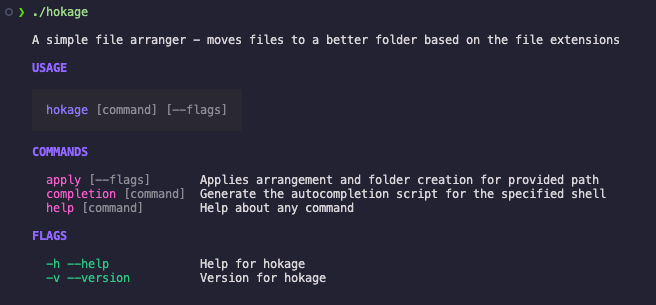
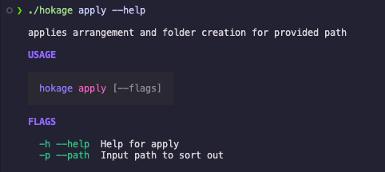

# Hokage

A simple file arranger built with [cobra](github.com/spf13/cobra) and [fang](github.com/charmbracelet/fang).

## Why?

Just a learning experience.

## How to Use?

```shell
git clone <clone-url>
```

then

```shell
go build -o hokage main.go
```

Showcase


